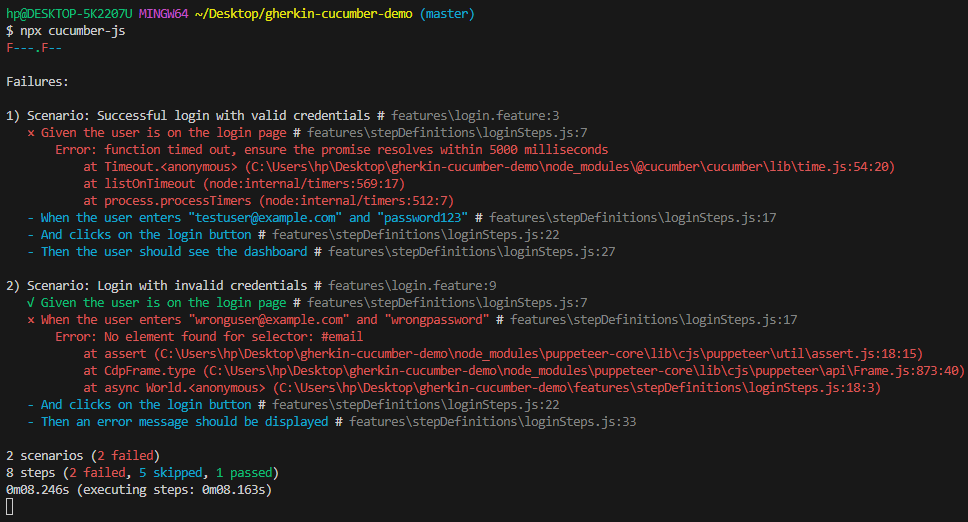

# Gherkin-Cucumber Demo

This project demonstrates how to use Gherkin syntax with Cucumber.js for behavior-driven development (BDD) testing. It includes automated tests for a login feature using Puppeteer for browser automation and Chai for assertions.

## Features

- **Login Page Testing**: Tests the login functionality by entering user credentials and verifying the dashboard or error messages.
- **Gherkin Syntax**: Uses Gherkin language to write human-readable test scenarios.
- **Cucumber.js**: Executes the Gherkin scenarios and maps them to step definitions.
- **Puppeteer**: Automates browser interactions for end-to-end testing.
- **Chai**: Provides assertion library for validating test outcomes.

## Getting Started

### Prerequisites

- Node.js installed on your machine.

### Installation

1. Clone the repository:
   ```sh
   git clone https://github.com/your-username/gherkin-cucumber-demo.git
   ```
2. Navigate to the project directory:
   ```sh
   cd gherkin-cucumber-demo
   ```
3. Install the dependencies:
   ```sh
   npm install
   ```

### Running the Tests

To run the tests, use the following command:

```sh
npx cucumber-js
```

#### Output



## Project Structure

- `features/`: Contains the Gherkin feature files.
- `features/stepDefinitions/`: Contains the step definitions that map Gherkin steps to code.
- `features/support/`: Contains support code and hooks (if any).

## License

This project is licensed under the MIT License.
